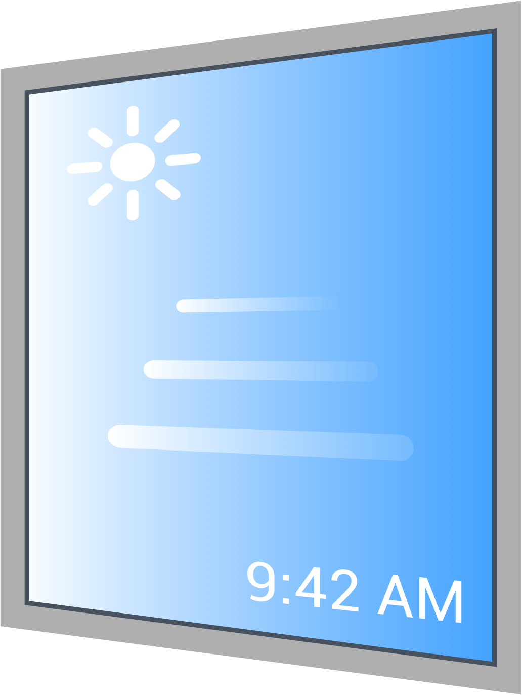
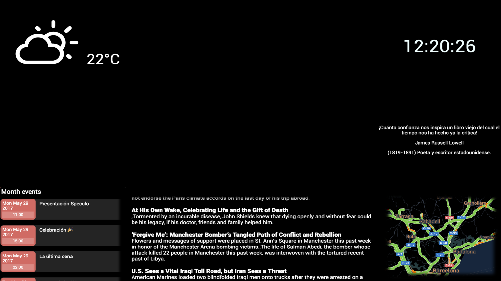
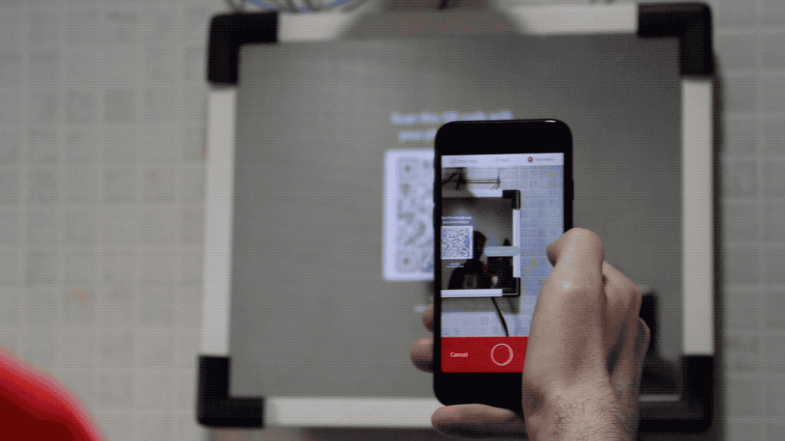

# Speculo: the smart mirror !

An easy to use, smartphone-controlled smart mirror that shows information based on modular and expandable widgets.

Please, note that this README file is made for demonstration purposes of our real project which can already be downloaded.

## Table of content

- [Features](#features)
- [Widgets](#widgets)
- [Installation](#installation)
- [Usage](#usage)
- [Video demonstration](#video-demonstration)
- [Hardware](#hardware)
- [Documentation and planning](#documentation-and-planning)
- [Technologies used](#technologies-used)
- [Purpose](#purpose)
- [Support](#support)
- [Authors](#authors)

## Features

### Easy to use

The software can be used by anyone that has a smartphone and it is intuitive, fast and updates on real time.

[/]: 

### Personal

You can add and move the widgets as you want and the configuration will be saved on your account.

[/]: 

### Cross-platform

The device that displays the mirror can be any OS. It is also possible to run it on a Raspberry Pi, so you can have a low-energy, easy-to-hide computer.

[/]: 

## Widgets

The mirror works by having several widgets distributed on the display. They show different information and are expandable, that is, we can built any widget with information that is needed. At the time we have developed this widgets:

- Clock
- Stock market information
- Google Calendar
- News from an RSS website
- Famous quotes retrieved from the wikiquote
- Traffic information using Google Maps
- Actual weather
- Weather prediction

## Installation

The web app runs on anything that can run a web browser. The only thing that you need to choose is which display is going to be the mirror.

On that device, yo can go directly to [this webpage](http://www.speculo.es/speculo/) or download the apps that we have in the [releases](/releases/latest) GitHub page.

The apps are available for **Mac**, **Windows** and **Linux**. We also offer a script for the **Raspberry Pi** made for Raspbian, so every time the device turns on it goes to the Speculo login screen. This is the way we implemented our hardware device test.

## Usage

Once you have the web or app running on the desired mirror display, grab your phone and scan the QR code!

In an updated iOS and some Android devices you can just point your phone with the camera app opened and will recognize the unique login link. Otherwise you can download a QR reader app from the App Store or Play Store.

Once you have scanned the QR code, you need to register or login with your credentials.

After login, you can change your settings on your smartphone and they will be updated on real time on your mirror.

## Video demonstration

If this still does not sell the project to you, watch the demo video that we made clicking on the image:

## Hardware

We were devoted to create an easy to use and expandable software, but also developed a first hardware approach so everybody could see our vision:

The device we used is an old computer display with an attached Raspberry Pi. In front of the display we placed a cheap mirror-like vinyl which did the job. Remember that this was made for test purposes and the final hardware idea can be much superior using different products (such as a real mirror-like screen crystal).

## Documentation and planning

As a full software engineering project, we developed the necessary projects and have them ready in case the project is continued:

* Vision Document
* SPMP (Software Project Management Plan)
* SRS (Software Requirements Specification)

The project was done using an agile scrum methodology.

## Technologies used

* HTML5
* CSS
* JavaScript
* PHP
* MySQL
* REST API
* [Nativefier](https://github.com/jiahaog/nativefier)

## Purpose

We developed this project for the Integrated Software Lab subject for the Autonomous University of Barcelona (UAB) with the intention to learn the technologies and languages used but with a sight to the future, as it the project can continue to be developed and be sold to final users or businesses.

## Support

The project is paused at this moment. If you want to support us you can let us know by **staring** this project. If you have any questions or want us to develop the idea with your business, send a mail to rafadiaz_dev@icloud.com.

## Authors

- **[Rafael Díaz](https://github.com/palancana)**

  - Team leader, HTML & CSS development

- **[Mario Arias](https://github.com/Shooter9)**

  - Team leader, JavaScript development

- **[Mario Aguilar](https://github.com/)**

  - Databases & PHP development

- **[Albert Soto](https://github.com/)**

  - JavaScript development

- **[Andres Jovanni](https://github.com/)**

  - JavaScript development

- **[David Ferran](https://github.com/)**

  - Databases & PHP development

- **[Camila Escobar](https://github.com/)**

  - HTML & CSS development